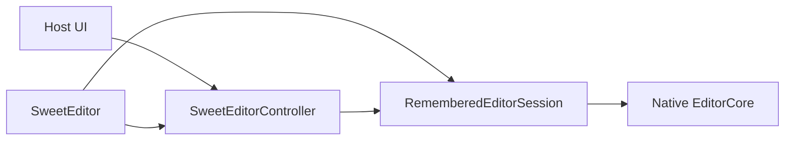

# Architecture

SweetEditor Compose follows a **declarative host**. The composable owns the native session. The controller only forwards commands.

## Rules

- `SweetEditorController` is the host command entry. It does **not** hold `EditorCore` or a native document handle.
- `SweetEditor` creates `RememberedEditorSession` and attaches the controller.
- One controller may bind only one editor. Recomposition of the same tree is fine; a second `SweetEditor` with the same instance fails `attach`.
- `whenReady { }` runs immediately if already ready, otherwise it is queued and flushed after attach + native create.
- Before ready, mutating APIs no-op. Query APIs return empty / default values (`getDocument()` falls back to `initialText`).
- `dispose()` on the controller clears event listeners and ready callbacks. It does **not** `free_editor`. Native lifetime follows the composable leaving composition.
- `getDocument()` returns `EditorDocument(text)` — a snapshot, not a native handle.

## Configuration inputs

`theme`, `settings`, and `keyMap` are composable parameters. The controller also has `applyTheme` / `setSettings` / `setKeyMap` for imperative updates after ready.

If both are used, the last write that reaches the session wins. Prefer one style per field.

## Events

Every document mutation goes through a single session `dispatchActionResult`. Query APIs do not return `EditorActionResult`. Subscribe with `controller.onTextChanged { }` or `controller.events.subscribe<TextChangedEvent> { }`.

## What the library does not do

- No built-in LSP or syntax engine. You push spans / completions via providers.
- No multi-cursor (C API has none).
- Web has no `create_document_from_file`.
