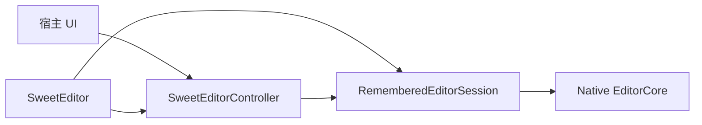

# 架构约定

SweetEditor Compose 是**声明式宿主**：Composable 拥有 native session，Controller 只转发命令。

## 规则

- `SweetEditorController` 是宿主命令入口，**不**持有 `EditorCore` 或 native 文档句柄。
- `SweetEditor` 创建 `RememberedEditorSession` 并 `attach` Controller。
- 一个 Controller 只能绑一个编辑器。同一棵树重组没问题；第二个 `SweetEditor` 用同一实例会在 `attach` 失败。
- `whenReady { }`：已就绪则立刻跑，否则排队，在 attach 且 native 创建后刷新。
- Ready 前变更 API 空操作。查询 API 返回空/默认（`getDocument()` 回退到 `initialText`）。
- Controller 的 `dispose()` 只清事件监听和 ready 回调，**不会** `free_editor`。Native 生命周期跟 Composable 离开组合走。
- `getDocument()` 返回 `EditorDocument(text)` 文本快照，不是 native 句柄。

## 配置入口

`theme` / `settings` / `keyMap` 是 Composable 参数。Controller 另有 `applyTheme` / `setSettings` / `setKeyMap` 供就绪后命令式更新。

两边都写时，最后到达 session 的写入生效。每个字段只选一种写法。

## 事件

文档变更都进 session 唯一的 `dispatchActionResult`。查询 API 不返回 `EditorActionResult`。用 `controller.onTextChanged { }` 或 `controller.events.subscribe<TextChangedEvent> { }` 订阅。

## 库不做的事

- 没有内置 LSP / 语法引擎。Span 和补全由宿主 Provider 推入。
- 没有多光标（C API 无）。
- Web 没有 `create_document_from_file`。
